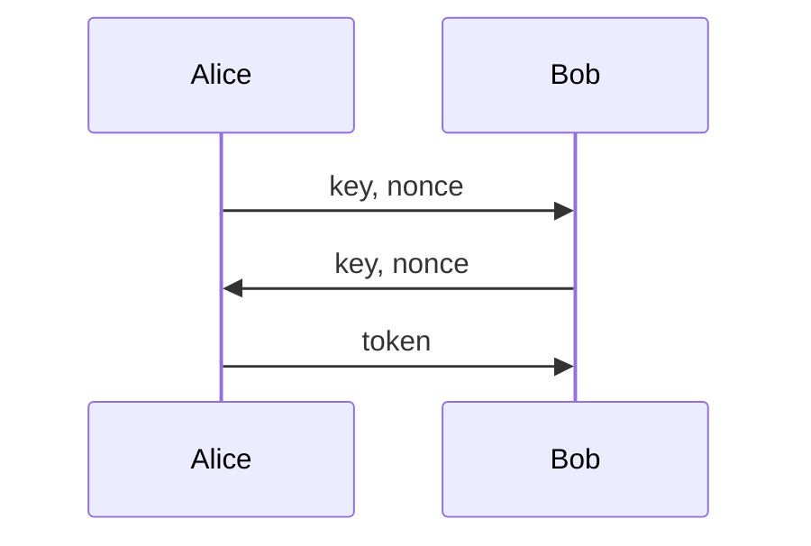

# The Sus Protocol

Sus is a secure and asynchronous protocol for sending messages between two parties. It is designed to be easy to use and to be secure against active and passive attacks. Sus makes it easy to send messages between two parties without having to worry about encryption, authentication, or message ordering.

## Features

- **Secure** - Sus is secure against active and passive attacks. It uses the [XChaCha20-Poly1305](https://tools.ietf.org/html/rfc8439) authenticated encryption algorithm to encrypt and authenticate messages. It uses [X25519](https://tools.ietf.org/html/rfc7748) for key exchange and [Ed25519](https://ed25519.cr.yp.to/) for authentication.
- **Asynchronous** - Sus is asynchronous and uses UDP as the underlying transport protocol. This means that messages are not guaranteed to arrive in the same order as they were sent. Sus takes care of reordering messages and discarding duplicate messages.
- **Easy to use** - Sus is designed to be easy to use. It is easy to set up a Sus network and send messages between two parties.

## Design

### Key exchange

The key exchange is done using the [X25519](https://tools.ietf.org/html/rfc7748) key exchange algorithm. The key exchange is done in the following steps:

1. Alice generates a key pair and sends the public key to Bob.
2. Bob generates a key pair and sends the public key to Alice.
3. Alice generates a shared secret using her private key and Bob's public key.
4. Bob generates a shared secret using his private key and Alice's public key.
5. Alice and Bob now have the same shared secret.

something-something secret key
